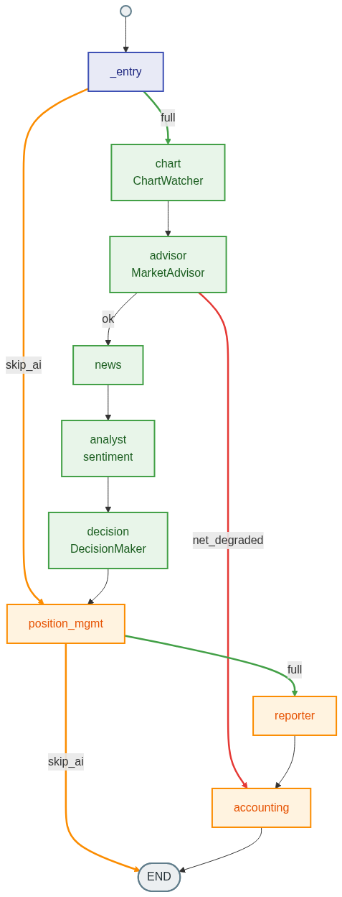

# XAUUSD AI Trading System

An experimental, automated multi-agent trading bot for **XAUUSD (Gold)**. A fixed
LangGraph pipeline of Claude agents reads multi-timeframe price action + news
sentiment, passes the setup through deterministic Python risk gates, and executes
on **MetaTrader 5**. State, trades and per-agent token cost are persisted to
**Supabase** (with a local JSON fallback).

> ⚠️ This is an experimental trading system that places **real orders with real
> money**. It is not financial advice and carries real risk of loss. See
> [Disclaimer](#disclaimer).

---

## Tech Stack

| Layer | What's actually used (traced to code) |
|---|---|
| Language | Python 3.11+ |
| Orchestration | LangGraph (`langgraph>=1.2`) — fixed `StateGraph`, no checkpointer |
| LLM provider | **Anthropic Claude** via `langchain-anthropic` (`market_advisor`, `analyst`, `decision_maker`) and the raw `anthropic` SDK (`chart_watcher`, `reporter`, `lesson_learner`) |
| Models (`agents/llm_models.py`) | `claude-sonnet-4-6` → chart_watcher, market_advisor, analyst, decision_maker · `claude-haiku-4-5-20251001` → reporter. Override per-agent with `MODEL_<AGENT>` env vars. |
| Embeddings (optional) | Google Gemini (`google-genai`) — used only by the Lesson-Retrieval RAG cache |
| Broker | MetaTrader 5 (`MetaTrader5` Python lib — **Windows only**) |
| Database | Supabase (Postgres + REST via the `supabase` client) with a `logs/trades.json` fallback |
| News/sentiment | X/Twitter via `twscrape`, ForexFactory/Investing scraping (`connectors/web_news.py`) |
| Dashboard | Flask + Waitress (port 5050) |
| Process mgr | PM2 (`main`, `dashboard`, `auto-deploy`) |

> Note: `psycopg2-binary` is pinned but the live bot does **not** use it — it's only
> for the legacy `db/migrate.py` (JSON → Postgres). The running bot talks to Supabase
> over REST via the `supabase` client.

---

## Architecture

```
┌──────────────────────────────────────────────────────────────────┐
│                        AI Agent Pipeline                          │
│                                                                  │
│  ChartWatcher ──→ MarketAdvisor ──→ Analyst ──→ DecisionMaker   │
│       │                                              │            │
│  (H4/H1/M15                                   Python risk gates  │
│  multi-TF analysis,                           → Claude quality   │
│  4-component trend,                             check            │
│  entry scoring)                                      │            │
│                                              MT5 open_order()    │
└──────────────────────────────────────────────────────────────────┘
         ↕ PostgreSQL / Supabase
┌──────────────────────┐
│  Dashboard (port 5050)│  ← Docker-ready
│  Flask + Waitress    │
└──────────────────────┘
```

---

## How the AI Pipeline Works (LangGraph)

The trading pipeline runs as a **state machine** — each step is a node in a graph, and the system decides which path to take based on real-time conditions.

### Graph Flow

<p align="center">
  
</p>

> **Legend** — 🟢 AI nodes (Claude) · 🟠 position-mgmt / reporter / accounting · 🔵 `_entry` router.
> Edge colors = the 3 auto-selected paths: 🟧 **orange** = skip-AI · 🟩 **green** = full cycle · 🟥 **red** = network-degraded.
> Regenerate with `python scripts/gen_graph_png.py` after editing the graph.

<details>
<summary>Text version (ASCII)</summary>

```
Every cycle (~15 min normal / ~5 min with open position)
                        │
                    [_entry]
                   /        \
           skip_ai?          full cycle
               │                  │
        [position_mgmt]       [chart_watcher]
               │                  │
              END             [market_advisor]
                              /           \
                    net_degraded?        OK
                         │                │
                    [accounting]       [news_gatherer]
                         │                │
                        END          [analyst]
                                          │
                                    [decision_maker]
                                          │
                                   [position_mgmt]
                                          │
                                     [reporter]
                                          │
                                    [accounting]
                                          │
                                         END
```

</details>

### What Each Node Does

| Node | Agent | Runs every cycle? | Description |
|---|---|---|---|
| `_entry` | — | Always | Checks whether to skip AI this cycle |
| `chart_watcher` | Claude | Full cycle only | Analyzes H4/H1/M15 charts — finds S/R zones, entry signal, confidence score |
| `market_advisor` | Claude | Full cycle only | Determines market regime (trending/sideways/volatile) and overall bias |
| `news_gatherer` | X/Twitter | Full cycle only | Collects latest tweets related to gold and macro economy |
| `analyst` | Claude | Full cycle only | Analyzes sentiment from news + chart combined |
| `decision_maker` | Claude | Full cycle only | Runs deterministic Python gates, then asks Claude a final quality check → EXECUTE or SKIP |
| `position_mgmt` | MT5 | **Always** | Manages open positions (momentum-exit, zone-break, partial close, breakeven, dynamic/post-event TP, trailing) + the inert swing campaign + manual-order scan |
| `reporter` | Claude | Full cycle only | Logs trade result, places pending orders, summarizes P&L |
| `accounting` | DB | Full cycle only | Records token cost and latency to database |

### 3 Paths — Chosen Automatically

**Path 1 — Full AI Cycle** (every ~15 min, or ~5 min when a position is open)
> All nodes run — AI makes the trade decision

**Path 2 — Skip AI** (between full cycles)
> Skips all AI agents → runs only `position_mgmt` to manage open positions
> Saves ~97% of token cost

**Path 3 — Network Degraded** (chart + advisor both fail)
> Halts decision-making → runs `accounting` and exits; no new orders placed

### Smart Skip Gate

To stay within a token budget while running 24/7, the gate **throttles** AI calls — it force-runs AI only on genuine signals, and throttles the rest:

| Condition | Behavior |
|---|---|
| Equity < `MIN_AI_EQUITY` | **Never runs AI** (capital floor — overrides everything); position mgmt still runs. ⚠️ unit = account currency — see note under [Decision Gates](#decision-gates--anti-fade-guards-live-reload--edits-apply-next-cycle-no-restart) |
| First cycle after start | Always runs |
| Price spike ≥ `AI_SPIKE_PIPS` (500) | Always runs — breaking news / flash crash (overrides throttle) |
| Ready Mode active (price at D1/W1 HTF zone) | Runs AI, but **throttled** to once per `READY_AI_MIN_SECS` (5 min) |
| Price within ≤ `AI_SR_PROXIMITY_PCT` (0.1%) of a **major HTF (D1/W1)** zone | Same 5-min throttle |
| News window (8–9, 13–15, 18–19 UTC) | AI interval reduced to 3 minutes |
| Otherwise | Normal: 15 min idle / 5 min with an open position |

> **Why throttle?** Older builds treated *every* H4/H1 minor S/R level (within 0.3%) **and** Ready Mode as "never skip", so the full 4-agent pipeline fired every ~2 minutes and dominated token cost (~$24/day). The gate now only force-runs on real signals (spikes, major D1/W1 zones) and caps AI frequency to once per 5 min during those windows — the spike override still reacts instantly to fast moves in any session.

### Why LangGraph?

| | Before (sequential) | After (LangGraph) |
|---|---|---|
| State | 6 scattered globals | Single `TradingState` TypedDict |
| Error handling | 6 duplicated try/except blocks | Isolated per node |
| Position mgmt code | Duplicated in 2 places | Single `position_mgmt` node |
| Cross-cycle state | Carried implicitly, easy to leak | Stateless per cycle — `compile()` has **no checkpointer**, so nothing bleeds between cycles; only `_last_chart_data`/`_last_sentiment` are carried forward explicitly |
| Adding a new agent | Edit main.py | One `add_node()` call |

---

## Requirements

| Component | Requirement |
|---|---|
| **Trading Bot** (main.py) | Windows + MetaTrader5 Terminal running |
| **Dashboard** | Windows / Linux / Docker |
| Python | 3.11+ |
| Node.js | 18+ (for PM2) |
| Database | Supabase (optional — falls back to `logs/trades.json`) |

> ⚠️ The `MetaTrader5` Python library only supports **Windows**

---

## Installation

### 1. Clone the repository

```bash
git clone git@github.com:JOTARO365/xauusd_ai_trading_system.git
cd xauusd_ai_trading_system
```

### 2. Install Python dependencies

```bash
pip install -r requirements.txt
```

### 3. Configure .env

```bash
# Windows
copy .env.example .env

# Linux/Mac
cp .env.example .env
```

Open `.env` and fill in the required values (see [Environment Variables](#environment-variables) below).

### 4. Set up the database (Supabase)

The bot persists trades, cycles and token-cost via the **Supabase REST client**
(`db/connection.py`). If Supabase is unreachable it falls back to a local
`logs/trades.json` so trading is never blocked by the DB.

1. Create a project at [supabase.com](https://supabase.com)
2. Go to **SQL Editor** → run `db/schema.sql` (see [SUPABASE.md](SUPABASE.md) for
   the full schema + RLS migrations)
3. In `.env`, set the **Supabase URL + service-role key** (the bot bypasses RLS):

```env
SUPABASE_URL=https://your-project.supabase.co
SUPABASE_SERVICE_KEY=your_supabase_service_role_key
```

> **No `DATABASE_URL` needed for normal operation.** A raw Postgres connection
> string is only used by the optional legacy migration script `db/migrate.py`
> (JSON → Postgres) via `psycopg2`. The running bot talks to Supabase over REST.
>
> **Running without a database is fine** — leave the Supabase keys unset and the
> bot logs everything to `logs/trades.json` (the dashboard and accounting then read
> from JSON).

---

## Running the System

### Option 1 — PM2 (Recommended)

```bash
# Install PM2
npm install -g pm2

# Start trading bot + dashboard together
pm2 start ecosystem.config.js
pm2 save

# Check status
pm2 list
pm2 logs main
pm2 logs dashboard
```

Common PM2 commands:

```bash
pm2 restart main        # restart trading bot
pm2 restart dashboard   # restart dashboard
pm2 restart all         # restart everything
pm2 stop all            # stop everything
```

### Option 2 — Direct

```bash
# Terminal 1: Trading bot
python main.py

# Terminal 2: Dashboard
python dashboard/app.py
```

---

## Dashboard

Open your browser at `http://localhost:5050`. Five tabs:

| Tab | Description |
|---|---|
| **Dashboard** | Portfolio equity curve (index-based x-axis), performance statistics, system-vs-manual split, trade history |
| **Live** | Real-time bot status, AI verdict (multi-TF), the **AI-zone analysis terminal** (below), Event Radar, the **Calendar & Gold-News feed** (below), RIDE / NEWS_GATE cohort cards, manual-range override |
| **Analytics** | Performance breakdown, confidence calibration, CFTC COT positioning |
| **Costs** | AI token spend, daily burn vs target, per-agent cost |
| **Settings** | Live config editing — saves and auto-restarts via PM2 |

### Chart-analysis panels (Live tab) — display-only, 0 AI cost

A UHAS-style analysis terminal, all computed in code by `chart_watcher` from MT5 price and served
via `bot_status.json` — these fields are **never sent to the LLM** (no token cost, no effect on gates):

- **AI-zone ladder** (H1/H4/D1/W1 support/resistance) — each zone shows a unified **0-100 strength
  score + grade (A/B/C)**, break-vs-bounce probability with test count, break-confirmation
  (held *ยืน* / wick *ไส้เทียน*), cross-TF + Fibonacci **confluence ⚡**, HTF-major-zone **★**,
  recency + average bounce ($)
- **Fair Value Gap (FVG)** — unfilled SMC 3-candle imbalances (entry / target zones)
- **Liquidity pools** (BSL / SSL equal-high/low stop clusters) · **Volume wall** + buy/sell
  tick-flow imbalance (labelled *tick-volume*, not contract volume)
- **Market structure** (HH/HL/LH/LL → UPTREND / DOWNTREND / ACCUMULATION / DISTRIBUTION) ·
  **entry-tech** (wait-for-wick-retrace = tighter SL, reversal next-candle confirmation) ·
  **double top/bottom** with measured-move target
- **Fibonacci** retracement · **Macro strip** (DXY / 10Y / real-yield) · **CFTC COT** positioning

### Calendar & Gold-News feed (Live tab)

A single module merges the economic calendar with per-post gold-news sentiment into a
click-to-expand list. Everything here is **display-only** — computed in code or from cached
data, with **zero AI calls** (no LLM cost from viewing the dashboard):

- **📅 Upcoming events** — CPI / NFP / FOMC rows with a live countdown. Click a row to slide
  open its **scenario**: `>forecast` vs `<forecast` panels (gold direction + magnitude %/$ + a
  3-bar strength meter — green = gold up / red = gold down), previous/forecast/actual numbers
  with a release-surprise highlight, 15-year reaction stats, and a **MACD-style histogram** of
  the last 12 releases (green = gold closed up / red = down, shade = momentum vs prior release).
- **📰 Latest gold news** — scored X / news posts (direction + strength tier + confidence);
  click to read the full text and rationale.

Scenario data is precomputed by `scripts/build_event_scenarios.py` (joins release dates with
daily XAU closes → `data/event_scenarios.json`) and served through pass-through `/api/*`
endpoints, so viewing never triggers an LLM call. Refresh all display data at once with
`python scripts/refresh_dashboard_data.py` (schedule it via Task Scheduler / cron).

---

## Docker

Two modes depending on your setup:

### Mode A — Linux containers (Dashboard only)

Standard Docker Desktop (Linux mode) — **no need to switch modes**

```bash
# Create .env first
cp .env.example .env   # Linux/Mac
copy .env.example .env  # Windows

# Start dashboard + postgres
docker compose up -d

# View logs
docker compose logs -f

# Stop
docker compose down
```

- Dashboard available at `http://localhost:5050`
- Trading bot (`main.py`) must run separately on the Windows host via PM2 or `python main.py`

### Mode B — Windows containers (Full system — Bot + Dashboard)

Docker runs everything: **Python, Node.js, PM2** and all Python packages.

**Requirements:**
1. Docker Desktop on Windows
2. Switch to Windows containers mode:
   - Right-click the Docker icon in the system tray
   - Select **"Switch to Windows containers..."**
3. MetaTrader5 terminal must be open and logged in on the host

```bash
# Create .env first
copy .env.example .env

# Build and run (first build takes ~15-30 min due to large image size)
docker compose -f docker-compose.windows.yml up -d

# View real-time logs
docker compose -f docker-compose.windows.yml logs -f

# Check PM2 status inside container
docker exec xauusd-trading powershell -Command "pm2 list"

# Restart a specific process
docker exec xauusd-trading powershell -Command "pm2 restart main"
docker exec xauusd-trading powershell -Command "pm2 restart dashboard"

# Stop everything
docker compose -f docker-compose.windows.yml down
```

### Comparison

| | Mode A (Linux) | Mode B (Windows) |
|---|---|---|
| **Command** | `docker compose up -d` | `docker compose -f docker-compose.windows.yml up -d` |
| **Trading Bot** | Must run separately on host | Included |
| **Image size** | ~500 MB | ~5-7 GB |
| **Build time** | ~2-5 min | ~15-30 min |
| **MetaTrader5** | Not supported | Supported (Windows IPC) |
| **Docker mode** | Linux (default) | Windows containers |

---

## 24/7 Cloud Deployment (GCP Windows VM)

Scripts in `scripts/` provision a Windows VM that runs MT5 + bot 24/7. A Windows host is required because MT5 needs a GUI session (`mt5.initialize()` attaches to a running terminal).

### One-shot (from GCP Cloud Shell)

```bash
# Creates an e2-medium Windows Server 2022 VM (Singapore), then installs
# Python/Git/MT5(XM) + clones the repo via a startup script.
bash scripts/create_vm.sh <github_token> <your_ip>/32
```

> ⚠️ **Security** — always pass `<your_ip>/32` (check at whatismyip.com) to restrict RDP. Open RDP (3389) to `0.0.0.0/0` is a top brute-force target; if you omit the IP, the script now **prompts for confirmation** before exposing it publicly.

### On the VM (after RDP in)

1. Open MT5 (XM) and log in once — the terminal must have run interactively
2. Fill `C:\trading\xauusd_ai_trading_system\.env`
3. Enable 24/7 auto-start (PowerShell **as Administrator**):

```powershell
C:\trading\xauusd_ai_trading_system\scripts\autostart_vm.ps1
```

This registers At-LogOn / Interactive scheduled tasks for the bot + dashboard that restart on crash and survive reboot. Follow the auto-logon note it prints so MT5 has a desktop session after reboots.

> The startup script (`setup_vm_startup.ps1`) is **idempotent** — it skips already-installed components on later boots (markers: `.mt5_installed`, `.deps_installed`). The dashboard port (5050) is **not** opened in the firewall; reach it from mobile over a private network (e.g. Tailscale) rather than exposing it publicly — the dashboard has no auth and can close trades / edit config.

### Auto-deploy & ops scripts

| Script | Purpose |
|---|---|
| `scripts/auto_deploy.ps1` (run via `pm2_autodeploy.js`) | PM2 watcher — every **60 s** runs `git fetch`; if the remote moved, does a stash-safe `git pull` + `pm2 restart main dashboard`. Pushed code reaches the VM automatically. |
| `scripts/health_check.ps1` | One-shot liveness check: process/PID, `bot_status.json` freshness, MT5 + cycle activity, dashboard `200`, today's token cost vs budget. `exit 0` healthy / `1` problem. |
| `scripts/apply_vm_config.ps1` | Safely edit the VM `.env` (e.g. `NNLB_EQUITY_PER_LOT`, `CHART_SHADOW`) — backs up first, edits only the target keys (keeps comments), restarts PM2, then verifies. Use `-DryRun` to preview. |
| `scripts/gen_graph_png.py` | Regenerate the LangGraph diagram (`docs/langgraph_state.png`). |

> ⚠️ **`.env` is git-ignored** — auto-deploy ships *code* only, never your `.env`. Change runtime config on the VM with `apply_vm_config.ps1` (or edit `.env` + `pm2 restart main`); a `git pull` showing "up-to-date" means code is synced, **not** that `.env` values changed.

---

## Environment Variables

### Required

| Key | Description |
|---|---|
| `ANTHROPIC_API_KEY` | Claude API key — [console.anthropic.com](https://console.anthropic.com) |
| `MT5_LOGIN` | MT5 account number |
| `MT5_PASSWORD` | MT5 password |
| `MT5_SERVER` | Broker server name (e.g. `ICMarketsAu-Demo`, `XMGlobal-MT5`) |

### Database (optional — falls back to `logs/trades.json` if unset)

| Key | Description |
|---|---|
| `SUPABASE_URL` | Supabase project URL |
| `SUPABASE_SERVICE_KEY` | service-role key — owner bot bypasses RLS (keep secret, never commit) |
| `SUPABASE_ANON_KEY` | anon key — only for the Phase-2 web layer (Supabase Auth + JWT) |
| `DATABASE_URL` | Postgres connection string — **only** for the legacy `db/migrate.py` script |

### Macro data (optional)

| Key | Description |
|---|---|
| `ALPHAVANTAGE_API_KEY` | Used by `scripts/update_regime.py` to refresh `agents/prompts/macro_regime.md` (CPI / Fed funds / 10Y). Free tier 25 req/day. |

### X/Twitter (for sentiment — optional)

| Key | Description |
|---|---|
| `X_USERNAME` | X (Twitter) username |
| `X_PASSWORD` | X password |
| `X_EMAIL` | X email (for 2FA) |
| `X_KEYWORDS` | Tweet filter keywords (word-boundary match). **Setting this overrides the code defaults entirely** (not merged) and is **not** live-reloaded — a `pm2 restart` is required. Defaults include gold/Fed/inflation plus geopolitics & macro (`Iran, Israel, ceasefire, war, oil, crude, CPI, rate cut, Hormuz, CENTCOM, Kharg, PPI, FOMC, Pakistan`) |

### Trading Config

> **Two "defaults" exist:** the `config.py` code fallback (used when the key is
> absent) and the value shipped in `.env.example` (what you actually run after
> `copy .env.example .env`). Both are shown where they differ.

| Key | `config.py` default | `.env.example` ships | Description |
|---|---|---|---|
| `SYMBOL` | `XAUUSD` | `GOLD#` | Trading symbol (XM Global uses `GOLD#`) |
| `START_BALANCE` | `5000` | `2000` | Starting balance in account currency |
| `LOT_MODE` | `auto` | `auto` | `auto` = risk-based sizing / `fixed` = use FIXED_LOT |
| `FIXED_LOT` | `0.01` | `0.01` | Used when LOT_MODE=fixed |
| `MIN_LOT` | `0.01` | `0.01` | Minimum lot size |
| `MAX_LOT` | `0.01` | `0.01` | Maximum lot size (caps all scaling — raise it for NNLB) |
| `RISK_PER_TRADE` | `0.02` | `0.02` | Risk per trade as a **raw fraction** — 0.02 = 2%, 0.50 = 50% (**NOT** 0.5%). Only used when `LOT_MODE=auto`; ignored in `fixed`. Hard-capped by `MAX_RISK_PCT`. |
| `MAX_DAILY_LOSS` | `0.10` | `0.10` | Max daily loss as a fraction (0.10 = 10%). Daily circuit breaker (gate 1). |
| `MAX_RISK_PCT` | `0.05` | `0.05` | **B1 safety net** — risk per trade can never exceed this fraction of balance regardless of `RISK_PER_TRADE` (prevents a mis-set RISK blowing the account when `LOT_MODE=auto`). `0` disables the cap. |
| `MAX_OPEN_TRADES` | `4` | `4` | Max simultaneous open trades |
| `DEFAULT_SL_PIPS` | `2000` | `2000` | Default SL in pips (XAU: 1 pip = $0.01) |
| `DEFAULT_TP_PIPS` | `5000` | `5000` | Default TP in pips |
| `MIN_RR_RATIO` | `2.0` | `2.0` | Minimum Risk/Reward ratio (breakeven WR = 33%) |
| `HEDGE_BUFFER_PIPS` | `2500` | `1000` | Pips before a counter-direction hedge order is allowed |

### Advanced Features

| Key | Default | Description |
|---|---|---|
| `LESSON_LEARNING` | `true` | RAG-based Lesson Retrieval — remembers past mistakes and warns DecisionMaker (requires GEMINI_API_KEY) |
| `DRY_RUN` | `false` | Mock MT5 execution — full pipeline runs but no real orders are sent |
| `NNLB_MODE` | `false` | **No-Risk-No-Lamborghini** — bypasses all gates and money management; lot scales with equity tier |
| `NNLB_BASE_EQUITY` | `100` | NNLB: minimum equity (**USD**) before first order — auto-converted to account currency |
| `NNLB_EQUITY_PER_LOT` | `100` | NNLB: profit (**USD**) per +0.01 lot — e.g. base 25 + per_lot 25 → equity $75 = lot 0.03 |
| `NNLB_MAX_LOSS_PCT` | `25` | NNLB: max loss per trade as % of equity — lot auto-reduced to stay within budget |
| `CHART_SHADOW` | `false` | A/B token test — runs a **terse-output** variant of `chart_watcher` in parallel on the same input, logging a field-by-field comparison to `logs/shadow_chart.jsonl`. Real trading is unaffected (always uses the verbose output). Analyze with `python scripts/shadow_report.py`; switch to terse only if `decision_match ≥ 95%`. |
| `EMA_PULLBACK_MAX_SL` | `1500` | EMA_PULLBACK toxicity gate — block the signal when planned SL ≥ this (wide SL = high ATR ≈ 0% win rate). Deterministic Python gate in `chart_watcher`. |
| `EMA_PULLBACK_MIN_CONF` | `70` | EMA_PULLBACK toxicity gate — block when confidence < this. Loss analysis: EMA_PULLBACK was the worst entry type (−$4.3k, 20% WR); the gate removes the proven-toxic slice (replay: +$2,981, 0 collateral). |
| `REPORTER_COOLDOWN_SEC` | `3600` | Min seconds between reporter perf-reports (higher = fewer Haiku tokens) |
| `AI_IDLE_GATE` | `false` | Stretch the AI throttle when the market is genuinely quiet (measures live M15 range vs its own median, not the clock). Price-spike override still reacts instantly. **Enable on the VM only after testing.** |
| `AI_QUIET_INTERVAL_SECS` | `1800` | When `AI_IDLE_GATE` is on and the market is quiet, run AI every 30 min (vs 15) |

### Background Threads & Experimental Sleeves

| Key | Default | Description |
|---|---|---|
| `GUARDIAN_ENABLED` | `false` | **Position-Guardian** daemon thread — manages open positions (breakeven / trailing / momentum-exit) on a fast poll, independent of the slower AI cycle. **Default OFF**; enable on the VM only after testing against live MT5 (concurrency + real money). Started in `main.py` via `agents/position_guardian.py`. |
| `GUARDIAN_INTERVAL_SEC` | `4` | Guardian poll interval (seconds) |
| `SPECIALIST_SHADOW` | `false` | **Specialist agents (Layer-A)** data-collection mode. When `true`, `node_specialist` computes the multi-TF zone ladder + trend/range candidates and appends the full `chart_data` snapshot to `logs/spec_shadow.jsonl` **without influencing the decision** (0 extra LLM calls — pure Python). Turn ON on the VM to accumulate ~2–4 weeks of replay data, then re-run `replay-validator` before enabling. See `docs/DESIGN_specialist_agents.md`. |
| `SPECIALIST_ENABLED` | `false` | **Specialist agents (Layer-A)** advisory mode. When `true`, feeds the top specialist candidate as one advisory line into the existing `decision_maker` Claude call — it does **not** add an LLM call and does **not** change the gates, the daily cap (6), or the confidence floor (62). **Default OFF**; enable only after the `replay-validator` report shows it's safe. |
| `SWING_ENABLED` | `false` | **SWING_HOLD** long-term/position sleeve (`agents/swing_manager.py`). Wired into the `position_mgmt` node but **inert** until this is `true` **and** equity ≥ `SWING_MIN_EQUITY`. Rule-only (no extra LLM calls). Tags its positions `SWG-` so the scalp protective functions skip them. |
| `SWING_MIN_CONF` | `70` | SWING: confidence floor (higher than the scalp `MIN_TECH_CONF` of 62) |
| `SWING_MAX_LEGS` | `3` | SWING: max scale-in legs per campaign |
| `SWING_TOTAL_RISK_PCT` | `20.0` | SWING: total risk budget per campaign as % of equity, split across legs; all legs share one structural SL so realized loss when hit is bounded by this cap |
| `SWING_LEG_SPLIT` | `40,30,30` | SWING: budget split across legs |
| `SWING_TF` | `D1,W1` | SWING: timeframes that may trigger a swing entry |
| `SWING_MAX_HOLD_DAYS` | `30` | SWING: force-close a campaign after N days (0 = no limit) |
| `SWING_MIN_EQUITY` | `3600` | SWING: minimum equity (account currency) before a campaign may open |

> The SWING_HOLD sleeve ships **inert** and unproven on live data — see
> [Known Limitations](#known-limitations). Its full design lives in
> `.claude/context/SWING_HOLD_spec.md` (local, not committed).

### Decision Gates & Anti-fade Guards (live-reload — edits apply next cycle, no restart)

All of these live in `config.py` and are re-read by `reload_config()` every cycle. Defaults
are backed by a replay over 489 real closed trades (see `scripts/diagnose_trades.py`).

| Key | Default | Description |
|---|---|---|
| `MIN_TECH_CONF` | `62` | Confidence floor for every entry (conf 50-59 band: WR 23.5%) |
| `ASIAN_MIN_CONF` | `72` | Asian/quiet session (0-7 UTC): ALL entries need this conf |
| `COUNTER_SPIKE_PIPS` | `500` | Block entries against a fresh spike ≥ this (0 = off) |
| `NEWS_FIRST` | `true` | Block entries against a clear news/macro bias |
| `NEWS_BIAS_MIN_CONF` | `55` | Analyst conf needed to count as "clear news bias" |
| `HTF_FADE_BLOCK` | `true` | No SELL at D1/W1 SUPPORT / no BUY at RESISTANCE |
| `NEWS_OVERRIDE_TREND` | `true` | Option C: news + price-action confirmation may enter against the H4 trend |
| `NEWS_CONFIRM_PIPS` | `500` | With-direction spike that counts as confirmation for option C |
| `NEWS_OVERRIDE_MIN_CONF` | `50` | Minimum conf for option C |
| `TREND_CONT_CONF` | `65` | Synthetic conf for TREND_CONT / NNLB HTF override entries |
| `TREND_CONT_MAX_DIST_PCT` | `0.3` | TREND_CONT must be a real pullback: price within this % of H1 EMA20 |
| `NNLB_FASTPATH` | `true` | `false` = NNLB entries always go through the Claude decision |
| `MIN_AI_EQUITY` | `150` | Equity below this → skip all AI calls (0 = off). **⚠️ unit = MT5 account currency, NOT USD** — see warning below |

> **⚠️ `MIN_AI_EQUITY` is in the account's currency — the code default `150` is THB-scale.** On a **USD account** this default silently blocks the bot whenever equity < $150 (e.g. a $100 account never calls AI — the skip path also bypasses accounting, so it's invisible in the DB). Set it to a USD-scale floor (e.g. `5`) on a USD account. This knob **is** live-reloaded (applies next cycle, no restart). `.env.example` ships `5`.
>
> **NNLB values are USD-canonical.** `NNLB_BASE_EQUITY` and `NNLB_EQUITY_PER_LOT` are entered in USD and auto-converted to the account currency at runtime (rate derived from gold's pip value: USD → ×1, THB → ×~36). One config set works for USD and THB accounts alike — no per-currency tuning. ⚠️ Also raise `MAX_LOT` (default `0.01` caps all scaling).

### Position Sizing (Confidence-based)

| Key | Default | Description |
|---|---|---|
| `CONF_FULL_SIZE_AT` | `80` | Confidence % for full position size |
| `CONF_MIN_SCALE` | `0.5` | Minimum size scale at low confidence |

Example: conf=50% → 0.63× size, conf=65% → 0.81× size, conf≥80% → 1.0× size

### Pending Orders

| Key | Default | Description |
|---|---|---|
| `MAX_PENDING_BUY` | `4` | Max pending buy orders |
| `MAX_PENDING_SELL` | `4` | Max pending sell orders |
| `PENDING_EXPIRY_HOURS` | `24` | Pending order expiry (hours) — code default `24`; `.env.example` ships `48` |

### Streak & Portfolio Protection

| Key | Default | Description |
|---|---|---|
| `PORTFOLIO_PROTECTION` | `true` | Enable/disable portfolio protection (daily loss limit, max trades) |
| `STREAK_PROTECTION` | `true` | Enable/disable losing streak protection |
| `MAX_LOSING_STREAK` | `5` | Consecutive losses before raising confidence threshold |
| `STREAK_MIN_CONFIDENCE` | `62` | Minimum confidence when streak is triggered |

### Dynamic Features

| Key | Default | Description |
|---|---|---|
| `DYNAMIC_TP` | `true` | Auto-extend TP when momentum is strong and price is near TP |
| `NO_TP_ON_EVENT` | `true` | Open orders without TP during high-impact news events |
| `NO_TP_EVENT_MINS` | `20` | If event is within X minutes, skip TP |
| `NO_TP_WAIT_MINUTES` | `30` | Wait X minutes after event before setting TP |

See all variables in [`.env.example`](.env.example)

---

## File Structure

```
├── main.py                    # Entry point — trading loop (every 300s)
├── config.py                  # Load config from .env + reload_config()
├── ecosystem.config.js        # PM2 config
├── Dockerfile                 # Linux image — dashboard only
├── Dockerfile.windows         # Windows image — bot + dashboard
├── docker-compose.yml         # Linux mode (dashboard + postgres)
├── docker-compose.windows.yml # Windows containers mode (full system)
├── docker-start.ps1           # Startup script for Windows container
├── start.bat                  # One-click startup for Windows host
│
├── agents/
│   ├── trading_graph.py       # LangGraph StateGraph — wires all nodes + routing
│   ├── chart_watcher.py       # H4/H1/M15 analysis, setup detection, SL/TP calculation
│   ├── market_advisor.py      # Market regime analysis
│   ├── analyst.py             # Sentiment analysis from news + X
│   ├── decision_maker.py      # Deterministic Python gates → Claude quality check
│   ├── swing_manager.py       # SWING_HOLD long-term sleeve (inert unless SWING_ENABLED)
│   ├── position_guardian.py   # Optional fast-poll daemon for open-position mgmt
│   ├── pending_manager.py     # Pending order management
│   ├── news_gatherer.py       # News aggregation
│   ├── news_cache.py          # News cache + Gemini embeddings (RAG)
│   ├── lesson_learner.py      # RAG-based lesson retrieval (warns DecisionMaker)
│   ├── reporter.py            # Trade result logging (Haiku)
│   ├── accountant.py          # Per-agent token cost + latency accounting
│   ├── llm_models.py          # Single source of truth: agent → model id
│   ├── schemas.py             # Pydantic schemas for structured LLM output
│   └── prompts/               # *.json = LIVE prompts · *.md = human docs
│
├── connectors/
│   ├── mt5_connector.py       # MT5 order management + lot sizing + position mgmt
│   ├── price_feed.py          # Price and indicator feed from MT5
│   ├── web_news.py            # ForexFactory + Investing.com
│   └── twitter_client.py      # X/Twitter client (twscrape)
│
├── db/
│   ├── schema.sql             # Table definitions (trades, agent_usage, cycles)
│   ├── connection.py          # Supabase client (service-role / anon+JWT)
│   ├── writer.py              # Upsert trades, insert cycles
│   ├── reader.py              # Query trades, accounting (+ JSON fallback)
│   ├── sync.py                # Sync MT5 history / JSON → DB
│   ├── lesson_store.py        # Lesson embeddings store
│   └── migrate.py             # Legacy JSON → Postgres (psycopg2 / DATABASE_URL)
│
├── ml/
│   └── train_filter.py        # Offline training of the learned trade filter
│
├── dashboard/
│   ├── app.py                 # Flask app (port 5050)
│   └── templates/
│       └── index.html
│
├── utils/
│   ├── market_clock.py        # Interval calculation + market sleep
│   └── display.py             # Rich terminal UI
│
├── agents/prompts/            # ⚠ *.json = LIVE prompts (loaded at import); *.md = human docs only
│   ├── *.json                 # chart_watcher/market_advisor/analyst/decision_maker — edit these to change agent behavior
│   ├── chart_watcher.md       # Doc: chart analysis + scoring rules
│   ├── decision_maker.md      # Doc: execute/skip quality check + pipeline context
│   ├── market_advisor.md      # Doc: regime analysis
│   ├── analyst.md             # Doc: sentiment analysis
│   ├── trend_strategy.md      # Doc: news-first hierarchy + trend rules
│   ├── reporter.md            # LIVE: reporter prompt (used directly, no .json)
│   └── macro_regime.md        # LIVE: macro regime context injected into analyst each cycle
│
├── backtest/
│   └── monte_carlo.py         # Monte Carlo simulation
│
├── .env.example               # Config template
├── requirements.txt
├── SUPABASE.md                # Supabase setup guide
└── CHANGELOG.md
```

---

## Core Features

### Entry Signal

- **Multi-timeframe analysis** — H4 (major S/R zones), H1 (minor zones + structure), M15 (entry trigger)
- **4-component H4 trend bias** — Price vs EMA200, H4 EMA50 slope, H1 EMA stack, H4 swing structure (≥3/4 required for BULLISH/BEARISH)
- **Signal types**: SR_ZONE, STRUCTURE_PULLBACK, EMA_PULLBACK, BREAKOUT_RETEST, ENGULFING, DOJI_AT_ZONE, MOMENTUM_BREAKOUT
- **Trend continuation (NNLB)** — H1+H4 EMA stack alignment triggers SELL/BUY without requiring a D1/W1 zone
- **H1 structure confirmation** — higher lows / lower highs from real swing points (+8-10 pts)
- **Bollinger Band squeeze** — BB reversal signals carry edge only when a squeeze precedes them
- **Fibonacci confluence** — +5-15 pts when price is at a key Fib level + zone

### Risk Management

- **ATR-based SL floor** — SL = max(wick distance, 1.0× H4 ATR) to avoid noise stop-outs
- **ATR sanity clamp** — the current H4 ATR is clamped into [0.4×, 2.5×] of its 20-bar median, so a thin/holiday-market bar can't distort the SL
- **SL range**: 500–3500 pips (XAU: 1 pip = $0.01)
- **Min R:R ratio**: 2.0 (breakeven WR = 33%)
- **Confidence-based position sizing** — conf 50%→0.63× size, conf 65%→0.81×, conf ≥80%→1.0×
- **Daily loss limit** — halts trading when max_daily_loss % is reached
- **Momentum exit** — closes positions early when strong counter-momentum detected (loss ≥100 pips + M15 momentum, or M1 spike ≥500 pips)

### Decision Layer — news-first entry hierarchy

The entry flow follows **news → price action → analysis → order**:

- **Anti-fade guards** (run before everything, both NNLB and normal mode):
  - **Counter-spike** — never enter against a fresh ≥`COUNTER_SPIKE_PIPS` move (price spiking up = no SELL; usually a news move)
  - **News-first** — when the analyst/macro-regime bias is clear (conf ≥ `NEWS_BIAS_MIN_CONF`), entries against it are blocked
  - **HTF-fade** — no SELL at a D1/W1 SUPPORT, no BUY at a D1/W1 RESISTANCE (fading major levels = high failure odds)
  - **News-override (option C)** — a counter-H4-trend entry is allowed only when it matches the news direction AND price action confirms (with-spike ≥ `NEWS_CONFIRM_PIPS`, or at a supporting HTF zone)
- **Replay-proven confidence gates** (validated over 489 real closed trades):
  - Floor **62%** for every entry (`MIN_TECH_CONF`) — the 50-59 band had WR 23.5% (−3,807 THB); HTF zones no longer lower the floor
  - **Asian session (0-7 UTC): every entry needs ≥72%** (`ASIAN_MIN_CONF`) — Asian averaged −115/trade
- **Deterministic Python gates** (quantitative filters in `_run_gates()`) run before calling Claude
- **Claude receives only a compact summary** — asked only "is the setup quality good enough?"
- **Capital floor** — equity below `MIN_AI_EQUITY` skips all AI calls; position management keeps running. ⚠️ The threshold is in the **account's currency** (code default `150` is THB-scale; a USD account should use ~`5` — `.env.example` ships `5`)

### Trade Management

- **Dynamic TP** — auto-extends TP when momentum is strong and price approaches TP
- **Breakeven management** — moves SL to breakeven after sufficient price movement
- **Zone-break close** — force-closes positions when M15 closes beyond the HTF zone by >300 pips; monitors for false-break re-entry over 4 hours
- **Hedge buffer** — allows counter-direction orders when price moves ≥ hedge_buffer_pips against open position
- **Pending orders** — BUY_STOP / SELL_STOP limit orders placed in advance
- **Weekly calendar pending** — places pending orders every Monday based on news calendar

### Infrastructure

- **Market sleep** — auto-pauses on weekends and when markets are closed
- **Portfolio protection** — daily loss limit, losing streak protection
- **PostgreSQL / Supabase** — stores trades, agent usage, cost tracking
- **Close-reason registry** — every bot-initiated close is tagged (`MOMENTUM_EXIT` / `ZONE_BREAK` / `CONFLICT_CLOSE`); SL/TP hits come from MT5 deal history — so per-exit diagnosis is possible (`scripts/diagnose_trades.py` segments + replays gates over DB history)
- **Per-agent token accounting, multi-provider ready** — each agent's model comes from `agents/llm_models.py` (`MODEL_<AGENT>` env override) and `accountant._normalize_usage()` accepts Anthropic / OpenAI-compatible / LangChain usage objects
- **Smoke test** — `python scripts/smoke_test.py` checks config knobs + entry guards after a refactor
- **Strategy versioning** — all new trades include `strategy_version=2` to distinguish from legacy data
- **Dashboard** — Flask web UI on port 5050: a UHAS-style analysis terminal (AI-zone ladder with 0-100 score/grade + break-bounce %/confluence/FVG/liquidity/volume/market-structure/entry-tech panels) plus a combined economic-calendar + gold-news feed with click-to-expand event scenarios (countdown, surprise panels, 15y stats, MACD-style reaction histogram) — all display-only, computed in code (no LLM cost)
- **PM2 process manager** — auto-restart, live config changes via dashboard

---

## Monte Carlo Simulation

Tests strategy robustness without historical trade data (uses assumed parameters):

```bash
# View all win rates in one table (recommended)
python -m backtest.monte_carlo --sweep

# Test a specific config
python -m backtest.monte_carlo --wr 0.42 --rr 2.0 --trades 200

# View all options
python -m backtest.monte_carlo --help
```

Sample results (R:R=2.0, risk=0.5%):

| WR | P(ruin >10%) | Assessment |
|---|---|---|
| 35% | 21% | Dangerous |
| 38% | 6% | Borderline |
| 40% | 2.3% | Acceptable |
| 42%+ | <1% | Safe |

The system requires **WR ≥ 40%** (breakeven = 33.3%, but a margin is needed).

---

## Multi-User Setup (RLS + Supabase Auth)

The system supports **multiple users on a single Supabase instance** — every trade and cycle is tagged with `account_login` (MT5 account number), and **Row Level Security (RLS)** enforces that each user sees only their own data.

> ⚠️ **Never share `SUPABASE_KEY` (anon/service) with users.** With RLS enabled, the anon key alone is denied everything; the service key is owner-only. Distribute access via the **API proxy** (bots) or **Supabase Auth JWT** (web) instead — see below.

### Roles & keys

| Who | Connects with | RLS | Sees |
|---|---|---|---|
| **Owner bot** (your VM) | `SUPABASE_SERVICE_KEY` (service_role) | bypassed | all accounts |
| **API proxy** (Render) | `SUPABASE_SERVICE_KEY` | bypassed | write only |
| **Web user** (Phase 2) | anon key + Supabase Auth **JWT** | enforced | own account only |
| **Leaked anon key** | anon, no JWT | deny-all | **nothing** |

### Setup (owner)

1. Create a Supabase project → run `db/schema.sql`, then `db/migration_enable_rls_auth.sql`
2. On the VM `.env`: set `SUPABASE_SERVICE_KEY=<service_role>` **before** running the RLS migration (so the bot keeps writing — it bypasses RLS)
3. Link a user to their MT5 account after they sign up:
   ```sql
   INSERT INTO user_accounts (user_id, account_login, role)
   VALUES ('<auth.users.id>', <mt5_login>, 'viewer');
   ```

```env
# Owner bot only — service_role bypasses RLS (keep secret, never commit/share)
SUPABASE_URL=https://xxx.supabase.co
SUPABASE_SERVICE_KEY=eyJhbGciOiJIUzI1NiJ9...
MT5_LOGIN=381706956
```

### Dashboard — View all accounts

```
# View your own account (default)
http://localhost:5050

# View all users combined (owner analytics)
http://localhost:5050  →  API: /api/data?account=all
                           API: /api/accounting?account=all
```

### Migration for existing databases

Run both SQL files in Supabase SQL Editor (or psql):

```bash
psql $DATABASE_URL < db/migration_add_account_login.sql
psql $DATABASE_URL < db/migration_add_api_keys.sql
```

---

## API Proxy (Distribute keys to users securely)

Instead of sharing the Supabase key directly — the owner deploys a proxy on Render.com (free tier) and issues individual keys to each user.

### Requesting access — you cloned the repo, now what?

A fresh clone ships with **no keys** (`.env` is git-ignored). To save trades to the shared database you need a `TRADING_API_KEY`, which **only the owner can issue** (this is the whitelist — not anyone can self-register yet). The flow is manual and out-of-band:

1. **Contact the owner** (Line / Discord / email) and provide:
   - your **MT5 login** (account number) — this becomes your data's owner tag
   - a display name (label) so the owner can recognize you
2. **Owner verifies** you actually own that MT5 account, then issues a key (see *Issue API keys* below).
3. **Owner sends you back two values** — put them in your `.env`:
   ```env
   TRADING_API_URL=https://xauusd-proxy.onrender.com   # owner's proxy URL
   TRADING_API_KEY=key_received_from_owner             # your personal key
   ```
4. Run the bot — trades now write through the proxy under *your* account only. You never touch a Supabase key.

> **Why manual?** The key binds to an MT5 login. Letting anyone self-claim a login would expose other users' data, so the owner vouches for each one. Self-service signup (web + ownership verification) is planned for Phase 2 — see `docs/saas_platform_plan.html`.
>
> **Lost / leaked your key?** Ask the owner to revoke it (`manage_api_keys.py` → *Revoke*) and issue a new one — old key dies instantly.

### Architecture

```
User Bot → HTTPS + API_KEY → Render Proxy → Supabase (service key)
Owner Bot ──────────────────────────────→ Supabase (service key, direct)
```

### Deploy Proxy (Owner does this once)

1. **Fork / push this repo to GitHub**
2. Go to [render.com](https://render.com) → New → Web Service → select the repo
3. Configure:
   - **Root Directory**: `api_proxy`
   - **Build Command**: `pip install -r requirements.txt`
   - **Start Command**: `uvicorn main:app --host 0.0.0.0 --port $PORT`
4. Add Environment Variables on Render:
   - `SUPABASE_URL` = Supabase project URL
   - `SUPABASE_SERVICE_KEY` = service_role key (Supabase → Settings → API)
5. Deploy → get a URL like `https://xauusd-proxy.onrender.com`

### Issue API keys to users

```bash
# Run on owner's machine — requires .env with SUPABASE credentials
python scripts/manage_api_keys.py
```

Select "Create new key" → enter MT5 login + username → get a key → send to user.

### User .env configuration

```env
# User only needs these — never sees the Supabase key
TRADING_API_URL=https://xauusd-proxy.onrender.com
TRADING_API_KEY=key_received_from_owner
```

---

## Migrate Legacy Data (JSON → Database)

If you have existing trade data in `logs/trades.json`:

```bash
# Sync to local PostgreSQL
python db/sync.py

# Sync to Supabase
python db/migrate.py
```

### Upgrade existing database (add strategy_version)

If you have an existing Supabase / PostgreSQL schema, run this SQL once:

```sql
ALTER TABLE trades ADD COLUMN IF NOT EXISTS strategy_version SMALLINT DEFAULT 1;
```

Old trades will have `strategy_version=1` (legacy), new trades will be `2` automatically.

### Decision-snapshot columns (learned filter v2)

To capture **leakage-free, decision-time features** on every new trade (for training a
learned trade filter), run `db/migration_add_decision_snapshot.sql` **before** deploying
the snapshot code (schema-before-code — else writes hit "column does not exist"):

```sql
ALTER TABLE trades ADD COLUMN IF NOT EXISTS planned_sl_pips NUMERIC;  -- planned SL at entry (NOT the break-even-moved sl)
ALTER TABLE trades ADD COLUMN IF NOT EXISTS entry_score     NUMERIC;
ALTER TABLE trades ADD COLUMN IF NOT EXISTS atr_h4          NUMERIC;
ALTER TABLE trades ADD COLUMN IF NOT EXISTS momentum        TEXT;
ALTER TABLE trades ADD COLUMN IF NOT EXISTS htf_zone_tf     TEXT;
```

> **Why a separate `planned_sl_pips`?** The live `sl` column is moved by break-even /
> trailing, so it leaks the outcome (winners end up with a tiny stop). Training on it
> gives a fake 0.87 AUC that collapses to 0.55 once removed. The snapshot stores the
> *original planned* values, frozen at entry. Train offline with `python ml/train_filter.py`.

---

## Current Trading Parameters

These are the `config.py` code defaults (the live SL/TP per trade are computed
dynamically by `chart_watcher` — ATR-based — and only fall back to these when no
better value is available):

| Parameter | Value | Reason |
|---|---|---|
| `min_rr_ratio` | **2.0** | Breakeven WR = 33% |
| `default_sl_pips` | **2000** | Fallback SL when ATR-based sizing isn't available |
| `default_tp_pips` | **5000** | Fallback TP (R:R 2.5:1) |
| `hedge_buffer_pips` | **2500** | Must move this far against the position before a hedge is allowed |
| `SL_MIN_PIPS` | **500** | Supports scalp setups |
| `SL_MAX_PIPS` | **3500** | Supports volatile sessions |
| `ATR_SL_MULT` | **1.0** | SL no lower than 1× H4 ATR |
| `CONF_FULL_SIZE_AT` | **80** | Full size at confidence ≥ 80% |
| `CONF_MIN_SCALE` | **0.5** | Half size at minimum confidence |

---

## Preset for Small Account (~$28 / 1,000 THB)

Use **NNLB mode** to bypass money management gates and scale lot with equity. NNLB
values are **USD** and auto-convert to the account currency, so this same preset
works for a USD or a THB account unchanged:

```env
NNLB_MODE=true
NNLB_BASE_EQUITY=25         # USD — min equity before first order (THB acct → ~900฿)
NNLB_EQUITY_PER_LOT=25      # USD — +0.01 lot per $25 profit above base
NNLB_MAX_LOSS_PCT=30        # Auto-reduce lot so max loss ≤ 30% per trade
MIN_LOT=0.01
MAX_LOT=0.05                # ⚠️ must be > MIN_LOT or lot can never scale up
DEFAULT_SL_PIPS=500         # Tighter SL to keep risk reasonable
DEFAULT_TP_PIPS=1500        # R:R 3:1
START_BALANCE=28
PORTFOLIO_PROTECTION=false  # Disable daily loss gate (too small to keep it enabled)
```

Lot progression with this preset: equity $28 (profit $3) → `lot 0.01`; equity $50
(profit $25) → `lot 0.02`; equity $75 → `lot 0.03` … capped at `MAX_LOT`.

> **Note**: With $28 capital and MIN_LOT=0.01, SL=500 pips — max loss per trade is $50 (178% of capital).
> The system will log an `NNLB ⚠` warning but will still enter since NNLB is explicitly an accept-all-risk mode.
> Recommended minimum for NNLB_MAX_LOSS_PCT to work effectively: **$100+**

---

## Known Limitations

- **Windows-only execution.** The `MetaTrader5` library requires Windows with a
  running, logged-in MT5 terminal. The dashboard runs anywhere, but the bot does
  not run on Linux/Mac.
- **`MIN_AI_EQUITY` is in the account's currency, not USD.** The `config.py` code
  default `150` is THB-scale; on a USD account this silently blocks all AI calls
  below $150. `.env.example` ships `5`. The skip path also bypasses accounting, so
  the block is invisible in the DB.
- **`NNLB_MODE` is an accept-all-risk mode.** It bypasses money-management and
  most quality gates and can size positions whose stop-out exceeds the account
  balance. It is intended for tiny accounts that knowingly accept ruin risk.
- **The SWING_HOLD sleeve is unproven and ships inert.** It is wired into the
  pipeline but disabled (`SWING_ENABLED=false`) and additionally gated by
  `SWING_MIN_EQUITY`. It has not been validated on historical or live data; the
  bounded-risk guarantee rests on a single shared structural SL.
- **No automated backtest harness for the *live* strategy.** `backtest/monte_carlo.py`
  runs a Monte Carlo on *assumed* win-rate/RR parameters, and live-strategy validation
  is done by replaying gates over closed trades (`scripts/diagnose_trades.py`), not by
  bar-by-bar simulation of the LLM pipeline. A separate **offline** bar-by-bar gauntlet
  (`scripts/regime_backtest.py`) does exist — but only for the R&D minimal-AI regime
  algos (`scripts/regime_lib.py`), which are flag-OFF and not wired to live. It replays
  intrabar (H/L, not close-path) net of cost with PSR + a null-first stance; its first
  run found **no directional edge** in the Donchian-breakout / z-score-fade entries on
  gold H1 (both −EV after cost) — consistent with this project's finding that gold
  *volatility/regime* is predictable but *direction* is not.
- **Two sources of "default".** `config.py` fallbacks and `.env.example` starter
  values differ for several keys (SYMBOL, START_BALANCE, HEDGE_BUFFER_PIPS,
  PENDING_EXPIRY_HOURS, BE_TRIGGER_R, MIN_AI_EQUITY). What you actually run is your
  `.env`.
- **Dashboard has no auth by default.** Port 5050 is unauthenticated unless you set
  `DASHBOARD_USER` + `DASHBOARD_PASS`. It can close trades and edit config — do not
  expose it publicly (reach it over a private network such as Tailscale).

---

## Disclaimer

This software is an **experimental research project**, provided **as-is with no
warranty**. It places **real orders with real money** on a live brokerage account
and can lose some or all of your capital. Nothing here is financial advice or a
solicitation to trade. Trading leveraged instruments like gold (XAUUSD) carries a
high risk of loss. **Use at your own risk**, start on a demo account, and never
risk money you cannot afford to lose. The authors accept no liability for any
financial losses incurred through use of this system.
